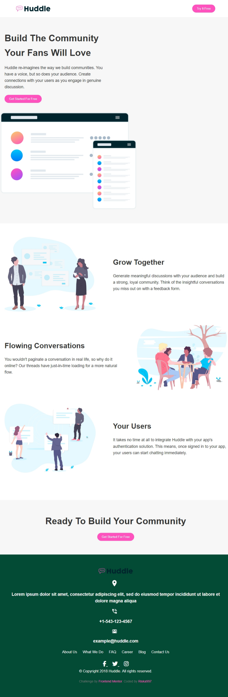

# Frontend Mentor - Huddle landing page with alternating feature blocks solution

This is a solution to the [Huddle landing page with alternating feature blocks challenge on Frontend Mentor](https://www.frontendmentor.io/challenges/huddle-landing-page-with-alternating-feature-blocks-5ca5f5981e82137ec91a5100). Frontend Mentor challenges help you improve your coding skills by building realistic projects. 

## Table of contents

- [Overview](#overview)
  - [The challenge](#the-challenge)
  - [Screenshot](#screenshot)
  - [Links](#links)
- [My process](#my-process)
  - [Built with](#built-with)
  - [What I learned](#what-i-learned)
  - [Continued development](#continued-development)
  - [Useful resources](#useful-resources)
- [Author](#author)
- [Acknowledgments](#acknowledgments)

## Overview

### The challenge

Users should be able to:

- View the optimal layout for the site depending on their device's screen size
- See hover states for all interactive elements on the page

### Screenshot

### Links

- Solution URL: [Github](https://github.com/Riska997/huddle-landing-page-with-alternating-feature-blocks-master.git)
- Live Site URL: [Netlify](https://deluxe-biscuit-81ea0e.netlify.app/)

## My process

### Built with

- Semantic HTML5 markup
- CSS custom properties
- Flexbox
- CSS Grid
- Mobile-first workflow

### What I learned

I learned about CSS Flexbox and Grid for creating responsive layouts. I also refined my skills in using CSS custom properties for maintaining consistent styling throughout the website.

### Continued development

I plan to explore advanced CSS techniques further and deepen my knowledge of JavaScript to incorporate interactive elements into your websites.

### Useful resources

- [W3school](https://www.w3schools.com/) 
- [Greeks4Greeks](https://www.geeksforgeeks.org/html-responsive-web-design/) - This helped me to make my web responsive through I feel that I need to study more on it.

## Author

- Linkedin - [ Prisca Mulishi](www.linkedin.com/in/prisca-mulishi-3994702a2)
- Frontend Mentor - [ @Riska997](https://www.frontendmentor.io/profile/Riska997)
- Facebook - [@mumu.479459](https://www.facebook.com/mumu.479459/)

## Acknowledgments

****Github **
vikramvi. I viewed his code that he did 2 years ago. Without his code, my code will still be incomplete and messy. And I will be lost. Thank you [vikramvi](https://github.com/vikramvi/Huddle-landing-page-with-alternating-feature-blocks/blob/main/styles/style.css#L1C1-L738C2).

